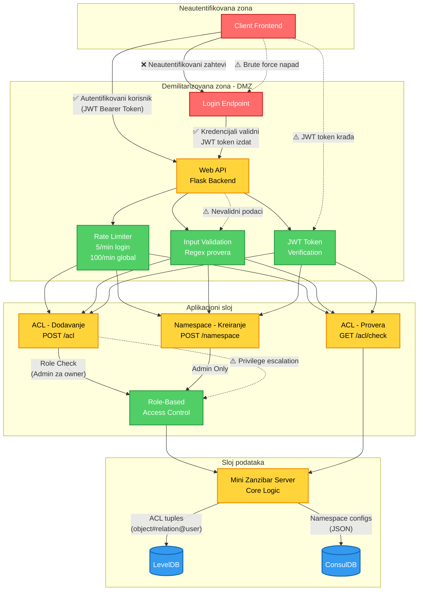

# mini-zanzibar

Zanzibar klon koji implementira podskup funkcionalnosti.

Studenti:

- Vladislav Radovic SV 27/2021
- Bojan Zivanic SV 61/2021

## OWASP API Security Zahtevi

Ovaj projekat pokriva ključne zahteve iz OWASP i ASVS za API bezbednost. U nastavku su detalji i primeri iz koda:

### 1. Autentikacija i autorizacija

- JWT login endpoint (`/api/login`): korisnik se prijavljuje sa username i lozinkom, dobija JWT token.
- Primer:
  ```json
  POST /api/login
  {
  	"username": "alice",
  	"password": "password123"
  }
  ```
- Role-based access control na ACL endpointu (`/api/acl`): samo admin može menjati owner ACL.
- Primer:
  ```python
  if data['relation'] == 'owner' and role != 'admin':
  		return jsonify({'error': 'Only admin can modify owner ACL'}), 403
  ```

### 2. Rate limiting

- Flask-Limiter ograničava broj zahteva na login (5/min po IP), na POST /api/acl (npr. 10/min po IP), i globalno (100/min).
- Primer za login:
  ```python
  @limiter.limit("5 per minute")
  def login():
  		...
  ```
- Default limit:
  ```python
  limiter = Limiter(
        get_remote_address,
        app=app,
        default_limits=["10 per minute"]
    )
  		...
  ```

### 3. Validacija podataka

- Regex validacija svih ulaznih podataka na endpointima.
- Primer:
  ```python
  object_re = r'^[a-zA-Z0-9:_\-]{3,64}$'
  if not re.match(object_re, data['object']):
  		return jsonify({'error': 'Invalid object format'}), 400
  ```

### 4. Audit log

- Svaka promena ACL-a se loguje sa korisnikom, ulogom i vremenom.
- Primer:
  ```python
  logging.info(f"ACL changed by {username} ({role}): {acl_tuple.to_string()}")
  ```

### 5. Hash lozinki

- bcrypt se koristi za sigurno čuvanje i proveru lozinki korisnika.
- Primer:
  ```python
  if not bcrypt.checkpw(password.encode(), user['password'].encode()):
  		return jsonify({'error': 'Invalid credentials'}), 401
  ```

### 6. Ne otkriva detalje o greškama

- Povratne vrednosti su opšte, bez stack trace-a ili internih podataka.
- Primer:
  ```python
  return jsonify({'error': 'Internal server error'}), 500
  ```

### 7. Kontrola pristupa

- Provera korisničke uloge za owner ACL i kreiranje namespace-ova (samo admin ima prava pristupa za ove funkcionalnosti).

### 8. Sigurnost JWT

- JWT tokeni se koriste za autentikaciju i autorizaciju.

### 9. Brute-force zaštita

- Rate limiting na svim endpoint-ovima sprečava brute-force napade.

---

Ove mere obezbeđuju osnovnu bezbednost API-ja u skladu sa OWASP preporukama.

## Threat Model



### Objašnjenje Threat Modela

**Trust Boundaries (Granice poverenja):**

1. **Neautentifikovana zona** - Spoljni klijenti bez autentifikacije
2. **DMZ (Demilitarizovana zona)** - Login i osnovni API gateway sa rate limiting-om
3. **Aplikacioni sloj** - Autentifikovani i autorizovani zahtevi
4. **Sloj podataka** - Perzistentno skladištenje sa kontrolisanim pristupom

**Identifikovane pretnje (⚠️):**

- **Brute force napadi** na login endpoint → Zaštita: Rate limiting (5/min)
- **JWT token krađa** → Zaštita: Token expiration (2h), HTTPS (preporuka)
- **Nevalidni podaci** → Zaštita: Stroga regex validacija
- **Privilege escalation** → Zaštita: Role-based access control

**Sigurnosne mere (✅):**

- JWT autentifikacija sa Bearer token šemom
- bcrypt hash za lozinke
- Rate limiting na svim endpointima
- Input validacija sa regex pattern-ima
- Role-based access control (samo admin može menjati owner ACL i kreirati namespace-ove)
- Audit logging svih ACL promena
